# WordPress Hosting Using AWS EC2, Nginx, PHP & MariaDB

## Project Overview

This project demonstrates how to deploy a fully functional WordPress website on an AWS EC2 Linux instance using:

- AWS EC2
- Nginx Web Server
- PHP 8.3
- MariaDB 10.5
- WordPress CMS

The project covers the complete installation and configuration process, including database setup, Nginx configuration, WordPress installation, and successful login to the WordPress Dashboard.

---

## Architecture Diagram

```text
                 ┌───────────────┐
                 │    Internet   │
                 └───────┬───────┘
                         │
                         ▼
               ┌─────────────────┐
               │ AWS EC2 Instance│
               │ Amazon Linux    │
               └────────┬────────┘
                        │
        ┌───────────────┼───────────────┐
        │               │               │
        ▼               ▼               ▼
   ┌────────┐     ┌──────────┐    ┌─────────┐
   │ Nginx  │────▶│ PHP-FPM  │────▶│ MariaDB │
   └────────┘     └──────────┘    └─────────┘
        │
        ▼
   ┌──────────┐
   │WordPress │
   └──────────┘
```

---

# Prerequisites

- AWS Account
- EC2 Instance (Amazon Linux)
- Security Group allowing:
  - HTTP (80)
  - HTTPS (443)
  - SSH (22)

---

# Step 1: Install Nginx, PHP and MariaDB

Connect to the EC2 instance using SSH and install the required packages.

```bash
sudo yum install nginx mariadb105-server php8.3 -y
sudo yum install php8.3-mysqlnd.x86_64
```

Restart all services:

```bash
sudo systemctl restart nginx
sudo systemctl restart mariadb
sudo systemctl restart php-fpm
```

Verify service status:

```bash
sudo systemctl status mariadb php-fpm nginx
```

Expected Result:

- Nginx = Active (running)
- PHP-FPM = Active (running)
- MariaDB = Active (running)

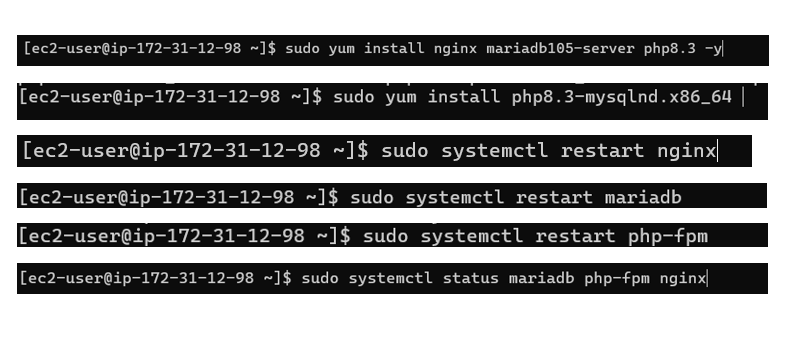
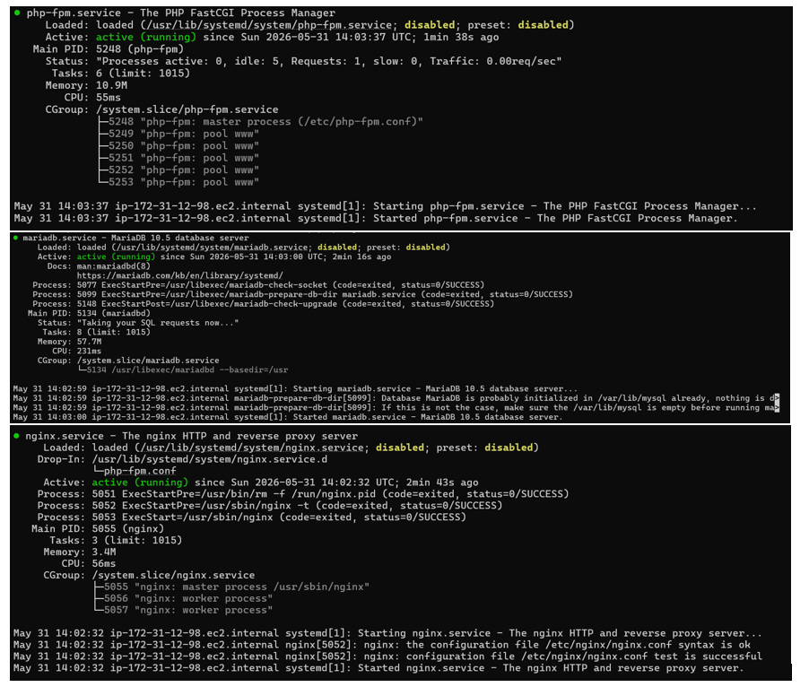
---

# Step 2: Configure MariaDB Root Password

Login to MariaDB:

```bash
sudo mysql
```

Set root password:

```sql
ALTER USER 'root'@'localhost'
IDENTIFIED BY 'Pass@123';
```

Exit MariaDB:

```sql
exit;
```

Login again using the password:

```bash
sudo mysql -u root -p
```

Enter:

```text
Pass@123
```


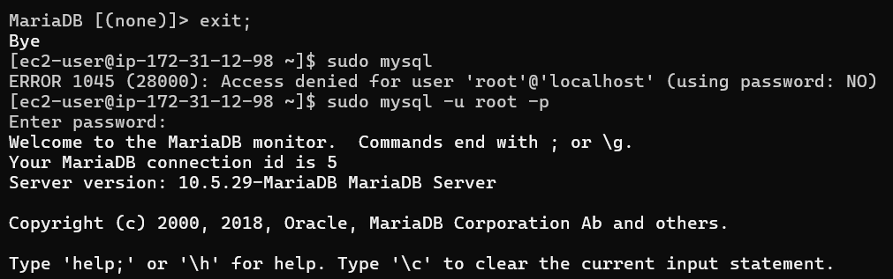
---

# Step 3: Create WordPress Database

Inside MariaDB create a database for WordPress.

```sql
create database wordpressdb;
```

Verify successful creation:

```text
Query OK, 1 row affected
```

Exit MariaDB:

```sql
exit;
```
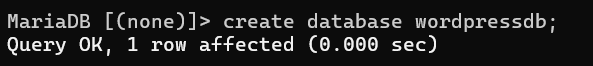
---

# Step 4: Download WordPress

Navigate to the Nginx web root directory.

```bash
cd /usr/share/nginx/html/
```

Download the latest WordPress package:

```bash
sudo wget https://wordpress.org/latest.zip
```

Extract the package:

```bash
sudo unzip latest.zip
```

Verify extraction:

```bash
ls
```

You should see:

```text
wordpress
latest.zip
```
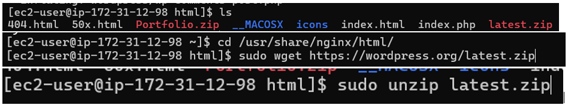
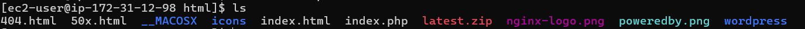
---

# Step 5: Configure Nginx for WordPress

Open the Nginx configuration file:

```bash
sudo nano /etc/nginx/nginx.conf
```

Update the server block:

```nginx
server {
    listen       80;
    listen       [::]:80;
    server_name  _;

    root         /usr/share/nginx/html/wordpress;
    index        index.php;

    include /etc/nginx/default.d/*.conf;

    error_page 404 /404.html;
    location = /404.html {
    }

    error_page 500 502 503 504 /50x.html;
    location = /50x.html {
    }
}
```

Reload Nginx:

```bash
sudo service nginx reload
```
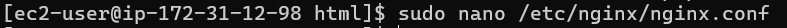
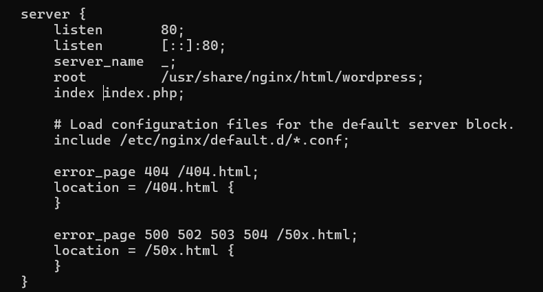

---

# Step 6: Access WordPress Setup Wizard

Open your browser and access:

```text
http://<EC2-Public-IP>/wp-admin/setup-config.php
```

Example:

```text
http://100.56.101.111/wp-admin/setup-config.php
```

WordPress installation page should appear.

Click:

```text
Let's Go!
```
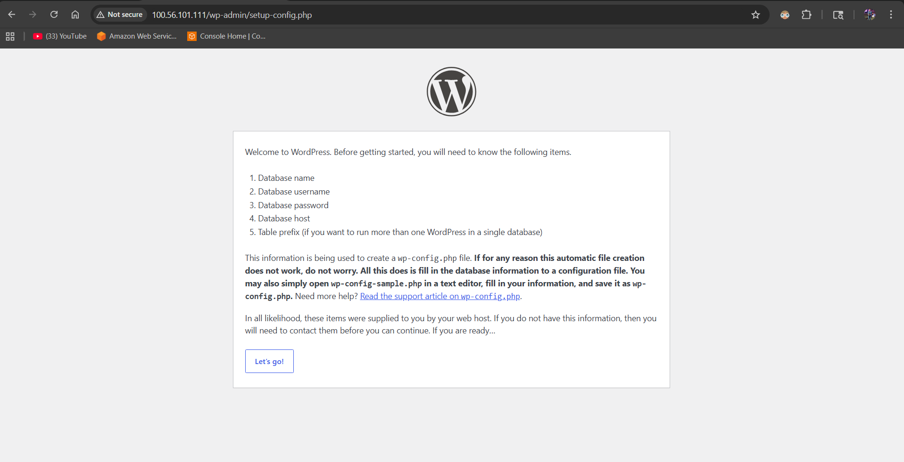
---

# Step 7: Configure Database Connection

Provide the following details:

| Field | Value |
|---------|---------|
| Database Name | wordpressdb |
| Username | root |
| Password | Pass@123 |
| Database Host | localhost |
| Table Prefix | wp_ |

Click:

```text
Submit
```

If the connection is successful, WordPress will display:

```text
WordPress can now communicate with your database.
```

Click:

```text
Run the Installation
```
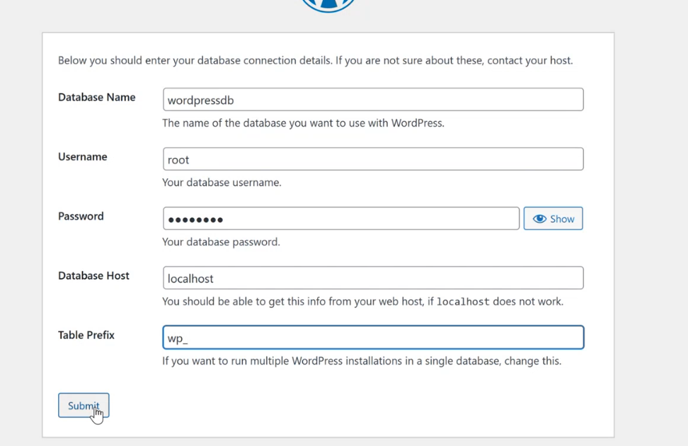
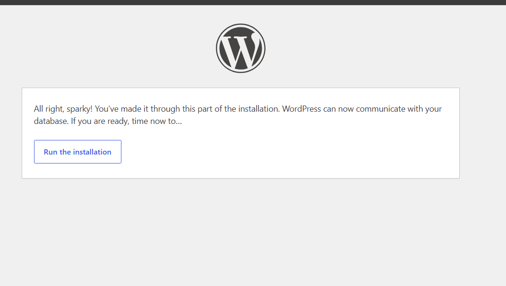
---

# Step 8: Configure WordPress Site

Enter site details:

| Field | Value |
|---------|---------|
| Site Title | test-Developer |
| Username | root |
| Password | root |
| Email | your-email@example.com |

Click:

```text
Install WordPress
```
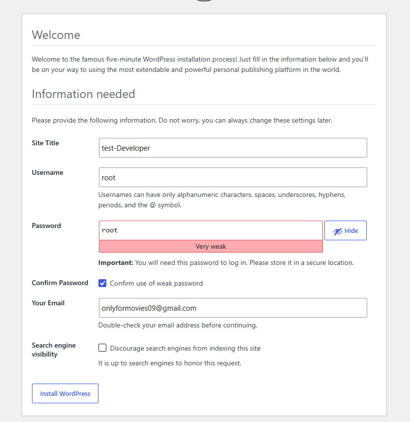
---

# Step 9: WordPress Installation Completed

After successful installation, WordPress displays:

```text
Success!
WordPress has been installed.
```

Click:

```text
Log In
```
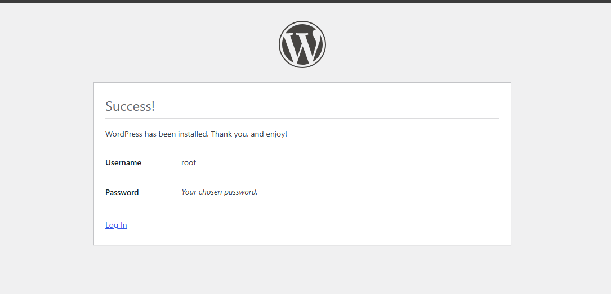
---

# Step 10: Login to WordPress Admin Panel

Login using:

```text
Username: root
Password: root
```

Click:

```text
Log In
```

Admin URL:

```text
http://<EC2-Public-IP>/wp-admin
```
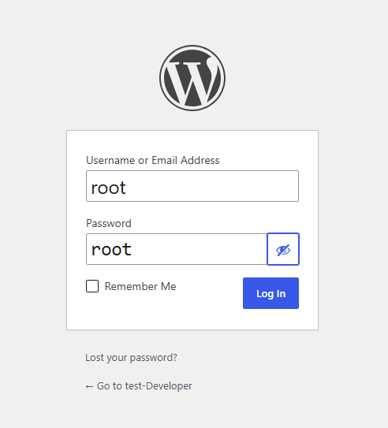

---

# Step 11: Access WordPress Dashboard

After successful login, the WordPress Dashboard becomes available.

Features available:

- Posts
- Pages
- Media
- Appearance
- Plugins
- Users
- Settings

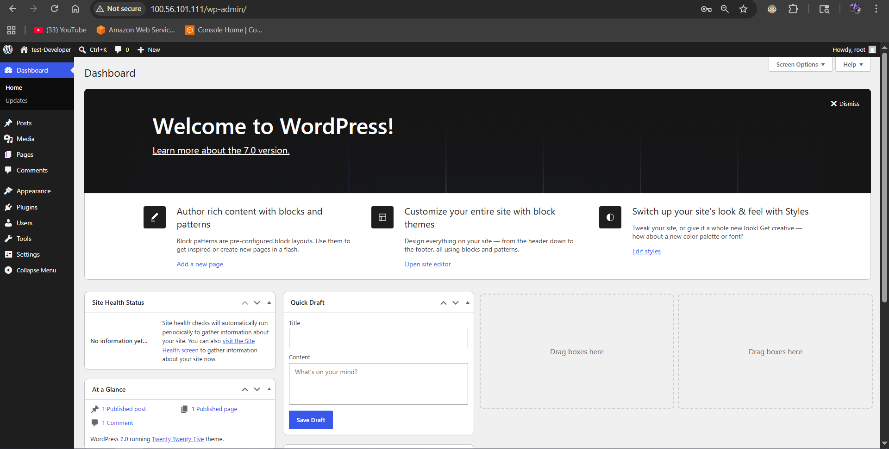
---

# Step 12: Verify WordPress Website

Visit:

```text
http://<EC2-Public-IP>
```

The default WordPress website should load successfully.

This confirms:

✅ EC2 Instance is running  
✅ Nginx is serving content  
✅ PHP-FPM is processing PHP requests  
✅ MariaDB is connected successfully  
✅ WordPress is fully operational

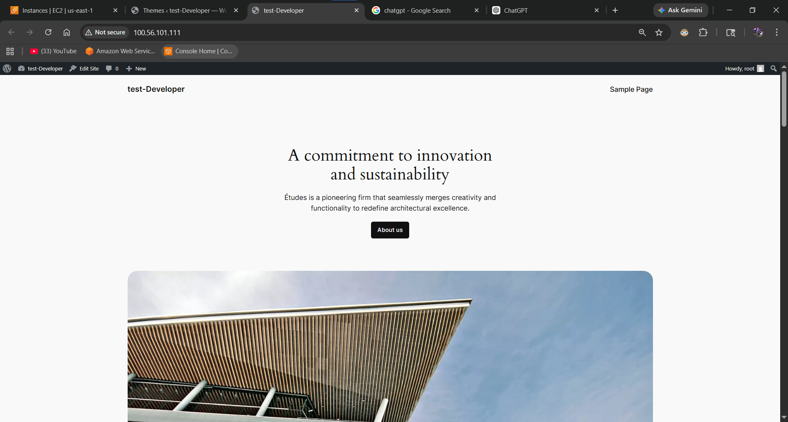
---

## Project Outcome

Successfully deployed and configured a production-ready WordPress environment on AWS EC2 using Nginx, PHP-FPM, and MariaDB. The setup includes database configuration, web server integration, WordPress installation, and administrative access through the WordPress Dashboard.

---

## Technologies Used

- AWS EC2
- Amazon Linux
- Nginx
- PHP 8.3
- PHP-FPM
- MariaDB 10.5
- WordPress
- Linux Commands
- Networking & Web Hosting

---
